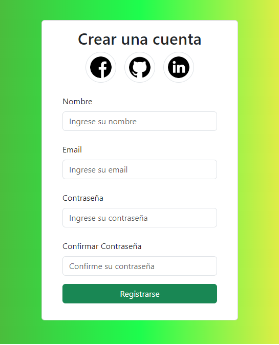

# Módulo 4 REACT I - Desafío 2 - Estado de los Componentes y Eventos - React + Vite

## Presentación Página Web

##  

 

## Descripción del PY ⌨️

En este proyecto validaremos nuestros conocimientos de la unidad “Estado de los componentes y eventos”. El desarrollo de este proyecto se realiza en parejas, por tanto, trabajamos de manera colaborativa usando GitHub. Además, pondremos en práctica los conceptos aprendidos para controlar los estados de nuestros componentes en React. Un cliente nos solicita una aplicación en React que permita al usuario validar un formulario de registro utilizando los eventos onChange y onSubmit, similar al de la imagen anterior.

## Tecnologías Usadas 🛠️

- **HTML** 💀
- **CSS** 🎆
- **JS** 🧑‍💻
- **REACT JS** 👌
- **React-Bootstrap** 📚

 

---

 

## Autores 👨‍💻

**Desarrolladores FullStack G-60 - Daniel Hernández T. y Luis Fernando Sanchez F.⚡**

Sígueme en mis redes sociales: 
 
